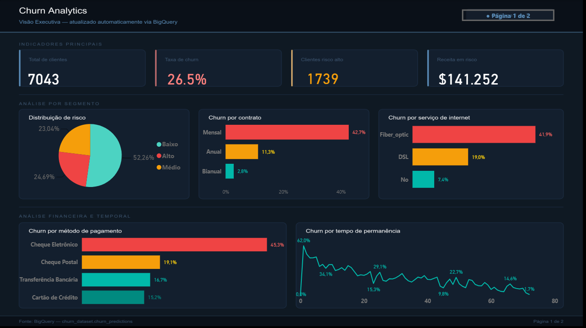
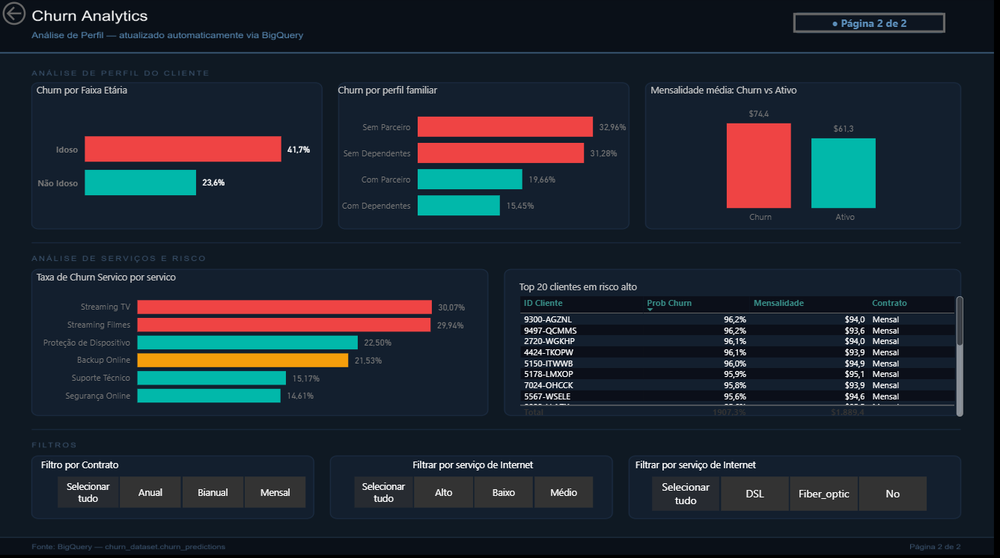

# Churn Analytics — Predição de Cancelamento de Clientes

> Pipeline completo de ciência de dados: do dado bruto no BigQuery até um modelo em produção, com dashboard executivo e interface para gestão.



---

## O Problema

Empresas de telecomunicações enfrentam um desafio silencioso: clientes que cancelam o serviço sem aviso prévio. Cada cancelamento representa não apenas a perda de receita recorrente, mas o custo de aquisição daquele cliente sendo desperdiçado.

O objetivo deste projeto foi construir um sistema completo capaz de identificar **quais clientes têm maior probabilidade de cancelar**, antes que o cancelamento aconteça — dando tempo para a equipe de retenção agir com base em dados, não em intuição.

---

## Arquitetura

```
BigQuery (data warehouse)
    ↓ SQL — limpeza, transformação e views analíticas
Python (notebooks + pipeline)
    ↓ EDA → Feature Engineering → Modelagem
FastAPI (API de predição)
    ↓ Deploy no Render
Streamlit (dashboard operacional)
    ↓ Deploy no Streamlit Cloud
Power BI (dashboard executivo)
    ↓ Conectado direto ao BigQuery
```

---

## O Dado

Utilizei o dataset **Telco Customer Churn** — 7.043 clientes de uma empresa de telecomunicações com 21 variáveis, incluindo perfil demográfico, serviços contratados, tipo de contrato e histórico de cobrança. Em vez de trabalhar diretamente com o CSV, fiz o upload para o **BigQuery** e tratei tudo via SQL — simulando o fluxo real de um data warehouse corporativo. O Python nunca tocou no dado bruto.

No BigQuery, criei uma arquitetura de views em camadas:

- `customers_cleaned` — limpeza de tipos, padronização de strings e criação de features de negócio como `tenure_group` e `AvgMonthlySpend`
- `churn_predictions` — tabela gerada pelo pipeline com as predições do modelo para todos os clientes
- `vw_bi_predictions`, `vw_bi_servicos_unpivot`, `vw_bi_perfil_familiar` — views otimizadas para consumo direto no Power BI, com strings traduzidas e dados no grão correto para interatividade
- `vw_data_quality` — view de monitoramento de qualidade dos dados, consultada pelo pipeline antes de cada execução

---

## Exploração e Insights

A análise exploratória revelou padrões claros sobre o perfil de clientes com maior risco de cancelamento. **26.5%** dos clientes cancelaram — dataset desbalanceado, o que exigiu tratamento específico na modelagem. Clientes com contrato **mensal** cancelam 15x mais que clientes bianuais: a baixa barreira de saída é o principal fator. O serviço de **fibra ótica** concentra 41.9% de churn — possível sinal de qualidade ou custo-benefício abaixo das expectativas. **Cheque eletrônico** como método de pagamento está associado a 45.3% de churn — perfil menos comprometido com o serviço. O período crítico são os **primeiros meses**: clientes que sobrevivem ao início tendem a permanecer.

A análise de correlação e VIF identificou multicolinearidade entre `TotalCharges` e `tenure` (0.83) e correlação perfeita entre `MonthlyCharges` e `AvgMonthlySpend` — ambas tratadas antes da modelagem, descartando as colunas redundantes.

---

## Modelagem

Testei quatro abordagens para encontrar o melhor modelo de classificação. O desbalanceamento de classes (73.5% ativos / 26.5% churn) foi tratado com **SMOTE** aplicado exclusivamente no conjunto de treino, e os hiperparâmetros do XGBoost foram otimizados via **RandomizedSearchCV** com 50 iterações.

| Modelo | Acurácia | Precisão | Recall | F1 | AUC-ROC |
|---|---|---|---|---|---|
| Regressão Logística | 0.793 | 0.635 | 0.516 | 0.569 | 0.828 |
| **Regressão Logística + SMOTE** | **0.749** | **0.521** | **0.706** | **0.599** | **0.820** |
| Random Forest + SMOTE | 0.762 | 0.546 | 0.615 | 0.579 | 0.797 |
| XGBoost + SMOTE | 0.751 | 0.526 | 0.612 | 0.566 | 0.785 |

A **Regressão Logística com SMOTE** foi a vencedora — não por acaso. As relações entre as features e o churn são predominantemente lineares neste dataset, o que favorece modelos mais simples. Modelos de ensemble mais complexos, mesmo após otimização, não conseguiram superar o modelo linear. O SMOTE elevou o recall de churn de 51.6% para **70.6%** — o modelo passou a identificar 7 em cada 10 clientes que cancelariam. Com mensalidade média de $66,78, o modelo gera uma **economia estimada de $15.197 (60.8%)** em relação ao cenário sem triagem.

---

## Recomendações de Negócio

Os dados revelam oportunidades concretas de retenção — não apenas padrões estatísticos, mas ações que a empresa pode tomar imediatamente:

- **Migração de contratos mensais para anuais** — clientes mensais têm 15x mais churn que bianuais. Oferecer um desconto progressivo para migração é provavelmente o investimento de retenção com maior retorno disponível. O custo do desconto é uma fração do custo de perder o cliente e readquiri-lo.

- **Investigação urgente da fibra ótica** — 41.9% de churn nesse plano é anômalo, muito acima dos 19% do DSL. Isso indica problema de qualidade percebida, expectativa não atendida ou custo-benefício inadequado. Uma pesquisa de NPS segmentada para esses clientes deve ser prioridade antes de qualquer campanha de retenção.

- **Programa de onboarding nos primeiros 60 dias** — o período crítico é o início do relacionamento. Um contato proativo nos primeiros dois meses — seja por suporte dedicado, tutoriais ou check-ins de satisfação — pode reduzir significativamente o churn total, já que a maioria dos cancelamentos ocorre nessa janela.

- **Incentivo ao débito automático** — clientes que pagam por cheque eletrônico cancelam 45.3% das vezes, contra 15-16% dos que usam cartão ou transferência automática. Oferecer um desconto na mensalidade para quem migrar para débito automático reduz a fricção de saída e aumenta o vínculo com o serviço.

- **Atenção especial ao público idoso** — 41.7% de churn contra 23.6% dos não idosos. Esse grupo provavelmente enfrenta dificuldades com o serviço ou não percebe o valor adequadamente. Um canal de atendimento diferenciado ou planos simplificados para esse perfil pode ser um diferencial competitivo relevante.

---

## Stack Técnica

| Camada | Tecnologia |
|---|---|
| Data Warehouse | Google BigQuery |
| Transformação | SQL (views e CTEs) |
| Linguagem | Python 3.11 |
| EDA | pandas, matplotlib, seaborn, statsmodels |
| Modelagem | scikit-learn, XGBoost, imbalanced-learn |
| API | FastAPI + Uvicorn |
| Dashboard operacional | Streamlit |
| Dashboard executivo | Power BI |
| Containerização | Docker |
| Deploy API | Render |
| Deploy Streamlit | Streamlit Cloud |
| Versionamento | Git + GitHub |

---

## Estrutura do Projeto

```
churn-analysis/
├── sql/                              # Views e transformações no BigQuery
│   ├── 01_create_view_customers_cleaned.sql
│   ├── 02_create_view_customers_analytics.sql
│   ├── 03_create_view_vw_bi_predictions.sql
│   ├── 04_create_view_vw_bi_servicos.sql
│   ├── 05_create_view_vw_bi_perfil_familiar.sql
│   └── 06_create_view_vw_data_quality.sql
├── notebooks/
│   ├── 01_eda.ipynb                  # Análise exploratória completa
│   └── 02_feature_engineering.ipynb  # Modelagem e seleção de modelo
├── src/
│   ├── bigquery_client.py            # Conexão com BigQuery
│   └── pipeline.py                   # Pipeline de predição e atualização
├── api/
│   └── main.py                       # FastAPI — endpoint de predição
├── app/
│   └── streamlit_app.py              # Dashboard operacional
├── models/
│   └── modelo_churn.pkl              # Modelo treinado
├── docker/
│   └── Dockerfile.api                # Containerização da API
├── images/                           # Screenshots do projeto
├── docker-compose.yml
└── requirements.txt
```

---

## Como Rodar Localmente

**Pré-requisitos:** Python 3.11+, Docker, conta no Google Cloud com BigQuery configurado.

```bash
# Clone o repositório
git clone https://github.com/MatheusAugustoEC/churn-analysis-portfolio.git
cd churn-analysis-portfolio

# Crie o ambiente virtual e instale as dependências
python -m venv venv
venv\Scripts\activate
pip install -r requirements.txt

# Configure as credenciais criando um .env na raiz:
# PROJECT_ID=churn-analysis-portfolio
# DATASET_ID=churn_dataset
# GOOGLE_APPLICATION_CREDENTIALS=credentials/sua-chave.json

# Rode a API
cd api && uvicorn main:app --reload

# Rode o Streamlit (novo terminal)
streamlit run app/streamlit_app.py
```

Via Docker:
```bash
docker-compose up --build
```

---

## Links

- 🌐 **Streamlit:** https://churn-analytics-portfolio.streamlit.app/
- ⚡ **API:** https://churn-api-g1y0.onrender.com/docs
- 📊 **Power BI:** disponível no repositório (`churn_analytics.pbix`)

---

## Screenshots

### Dashboard Executivo — Visão Geral


### Dashboard Executivo — Análise de Perfil


### Streamlit — Visão Geral


### Streamlit — Predição Individual


### Streamlit — Clientes em Risco

